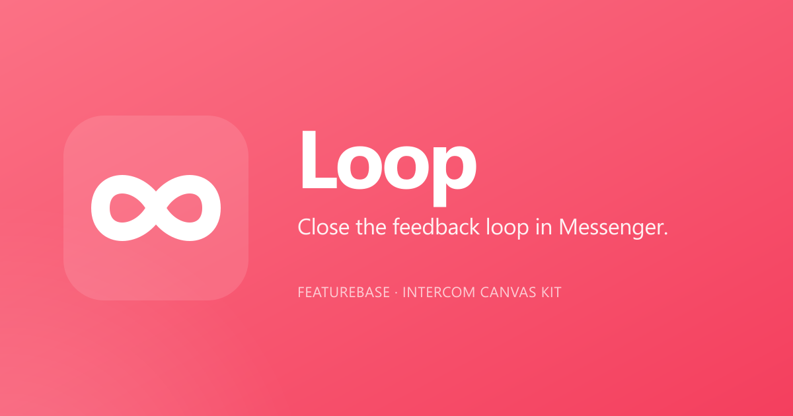

<p align="center">
  
</p>

<p align="center">
  <strong>Close the feedback loop in Messenger.</strong><br>
  Intercom Canvas Kit app that surfaces your Featurebase changelog and roadmap inside the Messenger your customers already use.
</p>

<p align="center">
  
</p>

<p align="center">
  <a href="https://github.com/Zsiecinski/featurebase-widget/actions/workflows/ci.yml"></a>
  <a href="#license">License</a>
</p>

---

## ⚡ Resume-here for new sessions

**Read [`PROJECT_STATE.md`](./PROJECT_STATE.md) first.** It's the canonical
status file: branch architecture, what's done, what's pending, key
decisions, gotchas, and how to resume.

## What it does

Loop is an Intercom Canvas Kit app rendered in the Messenger Home (and
optionally other Canvas Kit surfaces). It pulls live data from your
Featurebase API and renders two sections:

- **Recently shipped** — your Featurebase changelog (customer-facing
  entries with `state: live`), with colored type pills (NEW / IMPROVED /
  FIXED), an optional drill-down detail view, and a "See full roadmap"
  CTA.
- **Coming next** (optional) — in-progress roadmap items with a
  blue "IN PROGRESS" pill and upvote count. Surfaces the work-in-flight
  to customers so they anticipate what's coming.

Loop respects Featurebase's `hideFromBoardAndWidgets` flag so your
public board and Loop stay in sync visibility-wise.

## Architecture

Two deploys, one codebase. The same code runs both modes — what
differs is which env vars are set.

| | Single-tenant (`main`) | Multi-tenant (`multi-tenant`) |
|---|---|---|
| Purpose | Staytuned-internal Loop | Public App Store version |
| Featurebase credentials | Env var | Per-tenant in Postgres (AES-256-GCM encrypted) |
| Workspace identity | None (one workspace) | Intercom OAuth |
| Signature verification | Off (no `INTERCOM_CLIENT_SECRET`) | Enforced |
| `/auth/*` endpoints | Inactive | Active |
| `/admin/*` endpoints | Inactive (no `ADMIN_TOKEN`) | Active when token set |
| Tests | 35 | 48 |

All multi-tenant code paths are env-var gated. A `main` deploy with
no `DATABASE_URL` or `INTERCOM_CLIENT_*` set runs in pure single-tenant
mode. **Merging `multi-tenant` → `main` will not break a single-tenant
deploy** as long as you don't add those env vars.

## Endpoints

### Public surface

| Path | Method | Purpose |
|---|---|---|
| `/` | GET | Marketing landing page (`website/index.html`) |
| `/website/*` | GET | Static marketing site (docs, privacy, terms, styles) |
| `/assets/*` | GET | Brand assets (logos, pills, OG image) |
| `/health` | GET | `{ ok, mock, uptime, multi_tenant, db }` |

### Canvas Kit (called by Intercom)

| Path | Method | Purpose |
|---|---|---|
| `/initialize` | POST | Cold-open render |
| `/submit` | POST | Re-render on user tap (drill-down, expand, back) |
| `/configure` | POST | Render or save the Loop settings form |
| `/sheet/:id` | POST | Backward-compat redirect for stale cached canvases |

### Multi-tenant only

| Path | Method | Purpose |
|---|---|---|
| `/auth/install` | GET | Redirect installer to Intercom OAuth |
| `/auth/callback` | GET | OAuth code → token exchange, persist tenant |
| `/auth/uninstall` | POST | Intercom webhook for uninstalls |
| `/auth/data` | DELETE | GDPR right-to-erasure |
| `/admin/tenants/:workspace_id` | GET | Support tenant lookup (gated by `ADMIN_TOKEN`) |

### Debug

| Path | Method | Purpose |
|---|---|---|
| `/debug/changelogs` | GET | Raw Featurebase response with diagnostic fields (gated by `DEBUG_TOKEN`) |

## Local development

```bash
git clone https://github.com/Zsiecinski/featurebase-widget.git
cd featurebase-widget
npm install
cp .env.example .env
npm run dev
```

Loop boots in **MOCK mode** when `FEATUREBASE_API_KEY` is unset, so
you can develop and test without a real Featurebase org.

Open <http://localhost:3000/> for the marketing site, <http://localhost:3000/health> for the status JSON.

Hit the Canvas Kit endpoint to see what Intercom would see:

```bash
curl -X POST http://localhost:3000/initialize | jq .
```

## Configuration

All configuration lives in env vars. See `.env.example` for the full list.

### Single-tenant (current Staytuned deploy)

```bash
FEATUREBASE_API_KEY=fb_live_...
FEATUREBASE_CATEGORY=Kiwi
ROADMAP_URL=https://staytuned.featurebase.app/roadmap/kiwi-sizing
```

### Multi-tenant (public version)

```bash
# Database
DATABASE_URL=postgres://...
FB_ENCRYPTION_KEY=$(openssl rand -hex 32)

# Intercom OAuth + signing
INTERCOM_CLIENT_ID=...
INTERCOM_CLIENT_SECRET=...
INTERCOM_OAUTH_REDIRECT_URI=https://<your-domain>/auth/callback

# Optional ops
SENTRY_DSN=...
ADMIN_TOKEN=$(openssl rand -hex 32)
RATE_LIMIT_PER_MINUTE=120
```

## Tests

```bash
npm test
```

35 tests on `main`, 48 on `multi-tenant`. CI runs on every push and
PR via GitHub Actions (see `.github/workflows/ci.yml`).

## Deploying

Railway is the simplest path:

1. **New Project → Deploy from GitHub** → pick this repo
2. Pick the branch (`main` or `multi-tenant`)
3. Set env vars from the relevant section above
4. For multi-tenant: add the **Postgres** plugin (auto-injects `DATABASE_URL`)
5. **Generate Domain** under Networking

`npm start` auto-applies the DB schema before booting (idempotent —
safe to re-run).

After deploying, in Intercom Developer Hub set the three Canvas Kit URLs:

- **Initialize URL:** `https://<your-domain>/initialize?v=1`
- **Submit URL:** `https://<your-domain>/submit?v=1`
- **Configure URL:** `https://<your-domain>/configure?v=1`

Bump `?v=N` to bust Intercom's per-workspace canvas cache after any
deploy or configuration change.

## Brand kit

All Loop branding lives in `assets/`. Regenerate the PNG renders any
time the SVG masters change:

```bash
npm run logos
```

The CI workflow verifies PNGs are up to date — forgetting to commit
regenerated PNGs will fail CI.

## License

Proprietary. © Loop authors. Not for redistribution.

---

## Further reading

- [`LAUNCH_CHECKLIST.md`](./LAUNCH_CHECKLIST.md) — **step-by-step guide from current state to live on the App Store**
- [`PROJECT_STATE.md`](./PROJECT_STATE.md) — canonical project status, branch architecture, gotchas
- [`CHANGELOG.md`](./CHANGELOG.md) — what shipped per release
- [`MULTI_TENANT_ROADMAP.md`](./MULTI_TENANT_ROADMAP.md) — multi-tenant phase tracker *(on `multi-tenant` branch)*
- [`APP_STORE_LISTING.md`](./APP_STORE_LISTING.md) — App Store submission copy *(on `multi-tenant` branch)*
- [`PRIVACY_POLICY.md`](./PRIVACY_POLICY.md) — full privacy template *(on `multi-tenant` branch)*
- [`TERMS.md`](./TERMS.md) — full terms template *(on `multi-tenant` branch)*
